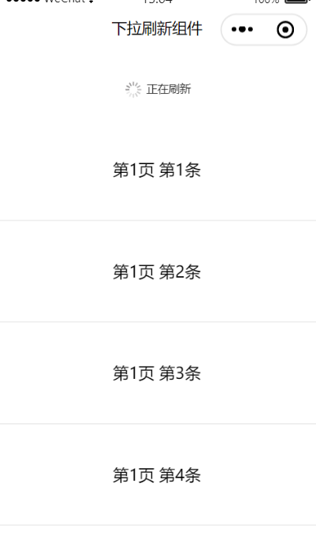
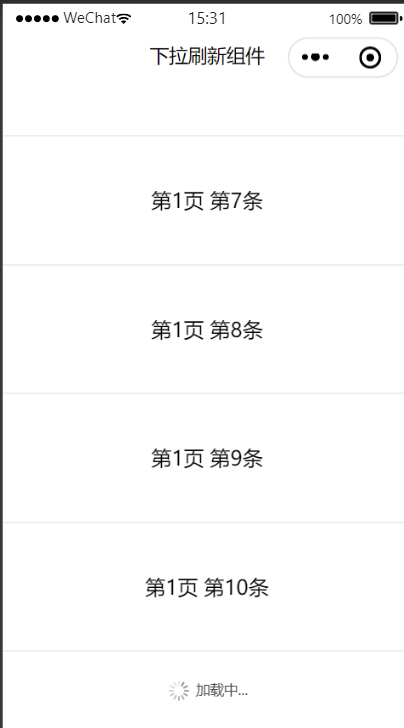

## 微信小程序下拉刷新/上拉加载组件
基于官方组件scroll-view进行封装，需要基础库2.10.1及以上

## 预览



## 功能

- 下拉刷新
- 上拉加载
- 支持自定义下拉样式
- 支持自定义上拉加载样式
## 使用示例

```bash
{
  "usingComponents": {
    "pull-refresh-view":"../components/pull-refresh-view/index"
  }
}
```

```javascript
<pull-refresh-view
  style="margin-top: 100px; height: 400px; border: 1px solid #000;"
  refreshing="{{isRefreshing}}"
  bindonrefresh="onRefresh"
  bindloadmore="onLoadMore"
  requesting="{{requesting}}"
  nomore="{{isFinish}}"
  loadmoreText="加载中..."
  isEmpty="{{ isEmpty }}"
  emptyUrl="https://oss.hqt.cjn.cn/hqt/pair-qsy.png"
  emptyText="暂无数据"
  scrollTop="{{scrollTop}}">
  <block wx:for="{{dataList}}">
    <view class="item">
      <text>{{item.name}}</text>
    </view>
  </block>
</pull-refresh-view> 
```

## 属性配置
|属性| 默认 | 说明  | 
|--|--|--|
| refresherEnable | true | 是否开启下拉刷新|
| refresherType | default |下拉刷新样式，可选：[‘default'，‘circle’，'custom']，custom表示用户自定义|
| pullText | 下拉刷新 | 下拉过程的文案提示，refresherType为default时生效|
| releaseText | 松开立即刷新 | 下拉达到刷新限定高度的文案提示，refresherType为default时生效|
| refreshText | 正在刷新 | 刷新中的文案提示，refresherType为default时生效|
| loadType | default |上拉加载样式，可选：[‘default'，'custom']，custom表示用户自定义|
| loadmoreText | 加载中 |  上拉加载的文案提示|
| nomoreText | 暂无更多数据 |  全部数据加载完毕的文案提示|
| pullDownHeight | 60 |  下拉刷新的高度限制，单位px |
| refreshing | false |  是否正在刷新，控制下拉刷新显示 |
| nomore | false | 是否全部加载完毕了 |
| showLoading | true | 是否显示上拉加载 |
| scrollY | true | 是否允许垂直滚动 |
| scrollToView | 无 | 值应为某子元素id（id不能以数字开头），滚动到该元素 |
| scrollWithAnimation | false | 在设置滚动位置时使用动画过渡 |
| requesting | false | 是否接口请求加载中 |
| isEmpty | false | 是否空数据 |
| emptyUrl | "../../images/pair-qsy.png" | 空状态的图片路径(可以是网址) |
| emptyText | 未找到数据 | 空状态的文字提示 |
| scrollTop | 0 | 设置竖向滚动条位置 |

## 事件监听
- bindonrefresh：下拉刷新监听
- bindloadmore：上拉加载监听
- bindonpulling：下拉过程监听
- bindscrolltolower：滚动到底部
- bindscrolltoupper：滚动到顶部
- bindscroll：滚动监听

## 注意事项

需要给pull-refresh-view一个固定高度或百分比高度，通过 WXSS 设置 height，参考项目示例代码

